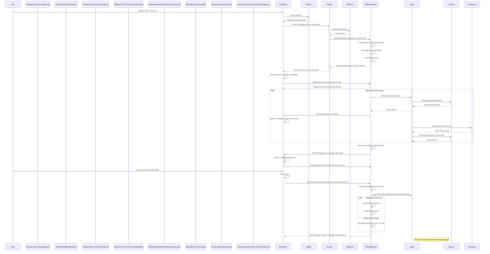

# Project Goal

To create an interactive web application using a monorepo structure:

- **Frontend**: A fork of ai-ng-swift (Next.js/React) providing voice and text input.
- **Backend**: A Python (FastAPI) service utilizing the browser-use library.
- **Functionality**: Users can converse with the agent (via voice or text) to initiate and guide browser automation tasks. The frontend will display chat history, a real-time view of the agent's browser actions (via screenshots), a summary of key steps, and optionally raw backend logs.

## Architecture Overview

### Monorepo Structure
- ai-ng-swift (forked) root containing the Next.js frontend (`app/`, etc.) and a `backend/` subdirectory for the Python/FastAPI code.

### Components
- **Frontend** (`app/`): Handles UI, VAD, microphone access, sends transcription requests, manages WebSocket connection for real-time updates and chat injection.
- **API Route** (`app/api/route.ts`): Handles initial audio/text submission, performs STT (via external service like Groq/OpenAI), and makes the initial HTTP call to the Python backend to start/update a session.

### Backend (`backend/`):
- Manages persistent browser-use Agent sessions
- Provides an HTTP endpoint (`/agent/task`) to initiate/update tasks
- Provides a WebSocket endpoint (`/ws/{session_id}`) for:
  - Sending agent status, screenshots, summaries, logs to the frontend
  - Receiving chat messages (text/transcribed voice) from the frontend to inject into the running agent
- Uses browser-use library for core agent logic and browser control
- Interfaces with configured LLM (OpenAI, Ollama, etc.)

## Sequence Diagram

# Project Plan - Implementation Steps

## Phase 1: Setup & Basic Backend Structure

### Monorepo Setup:
1. Confirm ai-ng-swift fork is cloned
2. Create `backend/` directory
3. Initialize Python environment (`.venv`) inside `backend/` using uv or venv/pip
4. Create `backend/pyproject.toml` with core dependencies:
   - FastAPI
   - Uvicorn
   - websockets
   - python-dotenv
   - browser-use
   - httpx
   - core langchain
5. Create `backend/.env` for backend-specific secrets/config (LLM provider, keys)
6. Create `.env.local` in root for frontend/shared secrets (STT provider/keys, backend URLs)
7. Update root `.gitignore`

### Install Dependencies:
1. Run `pnpm install` in root
2. Run `python -m uv pip install -e .` (or equivalent) inside `backend/`
3. Run `playwright install chromium` inside `backend/` (with env active)

### Basic Backend (`backend/main.py`):
1. Set up FastAPI app instance
2. Implement permissive CORS middleware (start with `origins=["*"]` for easy debugging, then restrict to `http://localhost:3000`)
3. Implement state dictionaries:
   - agents
   - agent_status
   - websockets
   - agent_tasks
4. Implement `get_llm_instance()` helper function (support Ollama and OpenAI initially)
5. Implement startup_event (LLM check) and shutdown_event (basic cleanup)
6. Implement basic `/agent/task` HTTP endpoint:
   - Accepts task and optional session_id
   - Handles new session creation ONLY for now (ignore existing sessions)
   - Creates Agent instance (using shared browser), stores it
   - Starts `agent.run()` in background (`asyncio.create_task`)
   - Stores task, sets status to "running"
   - Returns 202 Accepted with session_id
7. Implement basic WebSocket endpoint (`/ws/{session_id}` using APIRouter):
   - Accepts connection, stores WebSocket in websockets
   - Logs connection
   - Includes basic keep-alive loop (`asyncio.sleep`, maybe send ping)
   - Handles disconnects (remove from websockets)

### Basic Frontend API (`app/api/route.ts`):
1. Implement STT provider selection based on `process.env.STT_PROVIDER`
2. Perform transcription using selected provider (Groq/OpenAI)
3. Call the backend `/agent/task` endpoint with the transcript
4. Return the JSON response from the backend (containing session_id)

## Phase 2: Core Frontend Connection & Display

### WebSocket Client (`app/page.tsx`):
1. Add state variables:
   - sessionId
   - agentStatus
   - screenshotData
2. Implement `handleSubmitAction`:
   - Call `/api`
   - On success, store the received sessionId in state
3. Implement `connectWebSocket` function
4. Use `useEffect` hook to call `connectWebSocket` when sessionId changes. Handle cleanup (closing WebSocket)
5. Implement basic `ws.onmessage` handler to receive only screenshot messages and update screenshotData state. Add logging for other message types

### Basic UI (`app/page.tsx`):
1. Structure the basic 3-pane layout (Flexbox/Grid). Don't worry about perfection yet
2. Display agentStatus (initially hardcoded or updated simply on WS connect/disconnect)
3. Display the `` tag for screenshotData in the bottom-right pane
4. Keep the existing text input and add the microphone button (`handleMicClick` to start VAD, `onSpeechEnd` to call formAction)

## Phase 3: Backend Real-time Updates & Conversation

### Implement `agent_monitor_task` (`backend/main.py`):
1. Create the async function as previously defined
2. It should loop while agent_status is "running"
3. Periodically (`asyncio.sleep`) check `agent.state`
4. Extract step, goal, last_action, screenshot
5. Use `send_update` to send status and screenshot messages via WebSocket. Add timestamp

### Implement `agent_done_callback` (`backend/main.py`):
1. Define the async function
2. Process final history (success, result)
3. Set final agent_status
4. Use `send_update` to send the done message (with status, success, result)
5. Remove task from agent_tasks, but keep agent in agents

### Modify `run_or_update_agent_task` (`backend/main.py`):
1. Add logic to handle requests for existing session_ids where the agent is idle/done
2. If agent exists and is idle/done:
   - Find agent instance
   - Inject new task_description using `agent.message_manager._add_message_with_tokens(HumanMessage(content=...))`
   - Restart `agent.run()` task and `agent_monitor_task`
   - Update status to "running"
3. Ensure `task_completion_handler` is correctly defined and added via `add_done_callback` for both new and restarted tasks

### Modify WebSocket Endpoint (`backend/main.py`):
1. Implement `receive_json()` loop
2. Handle incoming `{ "type": "chat_message", "content": "..." }`
3. Find agent by session_id
4. Inject message content using `agent.message_manager._add_message_with_tokens(HumanMessage(content=...))`
5. If agent was idle/done, restart `agent.run()` and monitor tasks (similar logic to HTTP endpoint)
6. Send acknowledgement back via WebSocket if desired

## Phase 4: Frontend Enhancements

### Refine WebSocket Client (`app/page.tsx`):
1. Enhance `onmessage` to handle status (update step, goal, action), done, and error messages, updating corresponding state variables

### Implement Chat UI (Left Panel):
1. Add `chatMessages` state array
2. When user submits text/voice, add a `{role: 'user', content: transcript}` object to chatMessages
3. Modify WebSocket `onmessage` handler: When receiving agent_summary (or maybe just key status updates for now), add an `{role: 'agent', content: summary}` object to chatMessages
4. Render the chatMessages array

### Implement Key Steps UI (Top-Left-Right):
1. Add `keySteps` state array
2. Modify WebSocket `onmessage`: When receiving agent_summary (Phase 5 backend), add `{step: data.step, summary: data.summary}` to keySteps
3. Render keySteps

### Implement Raw Logs UI (Top-Right-Right):
1. Add `rawLogs` state array
2. Modify WebSocket `onmessage`: When receiving log_entry, add log to rawLogs
3. Render rawLogs (consider limiting the number displayed)

### Implement Continuous Speech:
1. Modify `handleMicClick` to toggle an `isRecording` state
2. Modify `onSpeechEnd`: If isRecording, transcribe the segment and send immediately via WebSocket (type: chat_message). Do not call formAction anymore
3. Modify mic button UI to reflect isRecording state
4. Layout Styling: Use Tailwind/CSS to style the 3 panes, chat bubbles, etc. Add resizing using react-resizable-panels if desired

## Phase 5: Backend Advanced Features

### Step Summarization (`backend/main.py`):
1. Implement `summarize_step` function (using a separate LLM call as discussed)
2. Modify `agent_monitor_task` to call `summarize_step` and send agent_summary messages via WebSocket

### Log Streaming (`backend/main.py`):
1. Integrate `logging.QueueHandler` and `QueueListener`
2. Modify `websocket_endpoint` to start a listener task that reads from the session's queue and sends log_entry messages. Ensure proper handler cleanup on disconnect/shutdown

## Phase 6: Refinement & Testing

### Error Handling
- Improve robustness on both frontend and backend:
  - WebSocket disconnects
  - Agent errors
  - LLM errors
  - Transcription errors

### UI/UX Polish
- Improve styling
- Add loading indicators
- Clear states appropriately
- Refine VAD/recording interaction

### Configuration
- Consider making LLM/STT choices configurable via the UI instead of just env vars (more complex)

### Agent Cleanup
- Implement logic in the backend to clean up inactive agent sessions/browser contexts after a timeout

### Testing
- Test various tasks
- Test conversational flows
- Test error conditions
- Test different browsers
